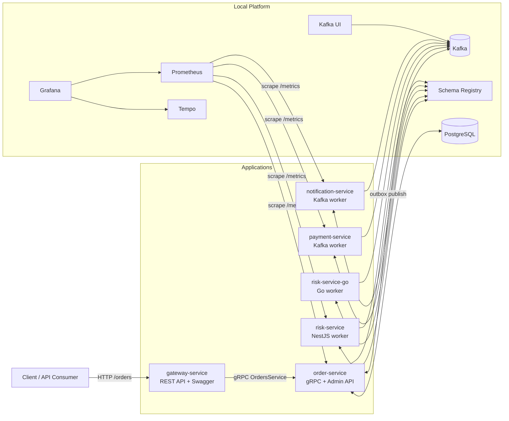
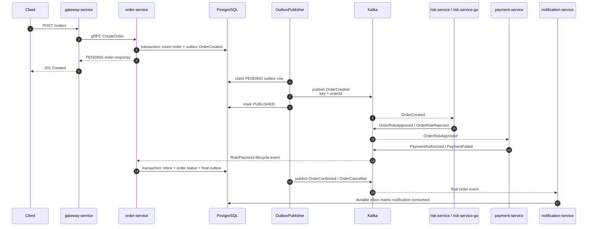
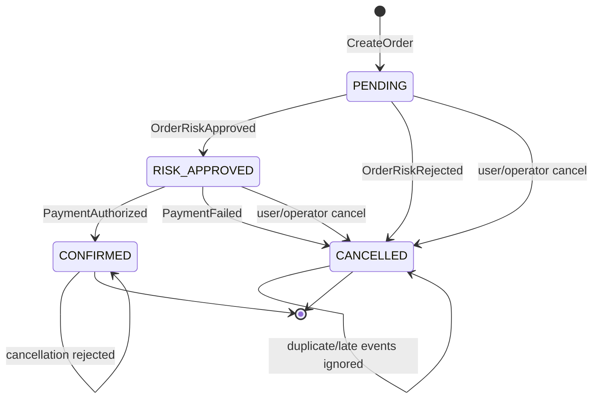
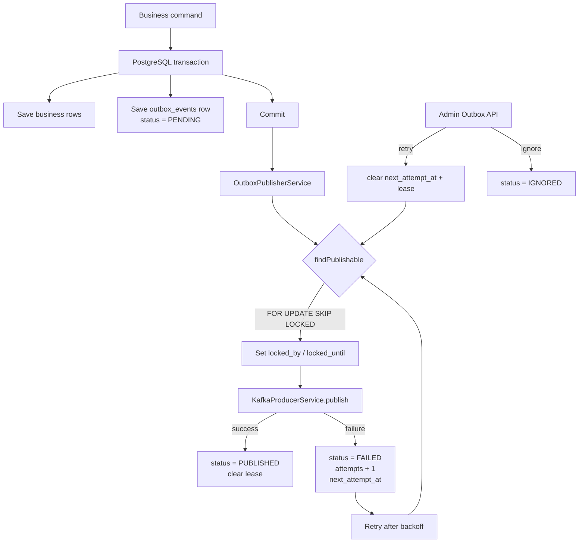
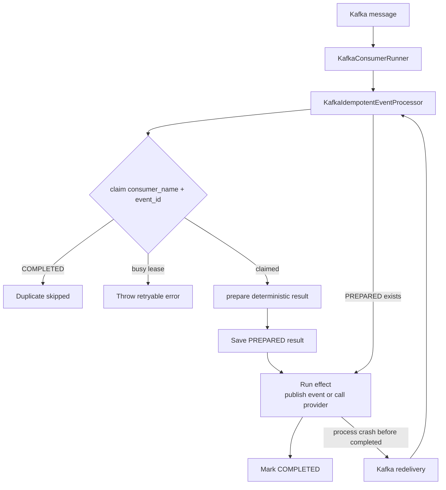
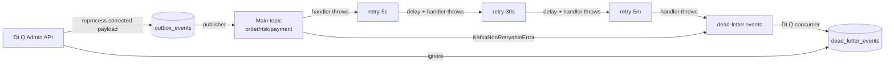
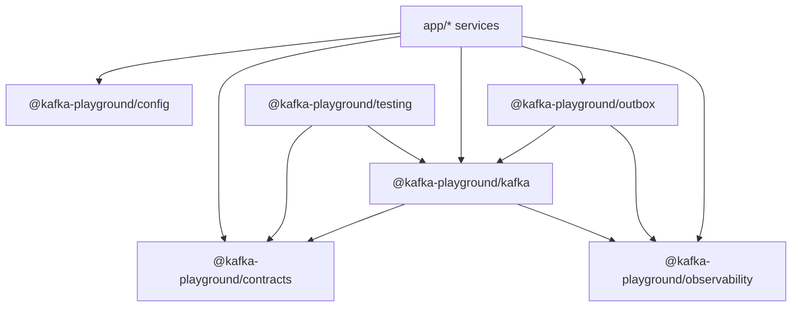
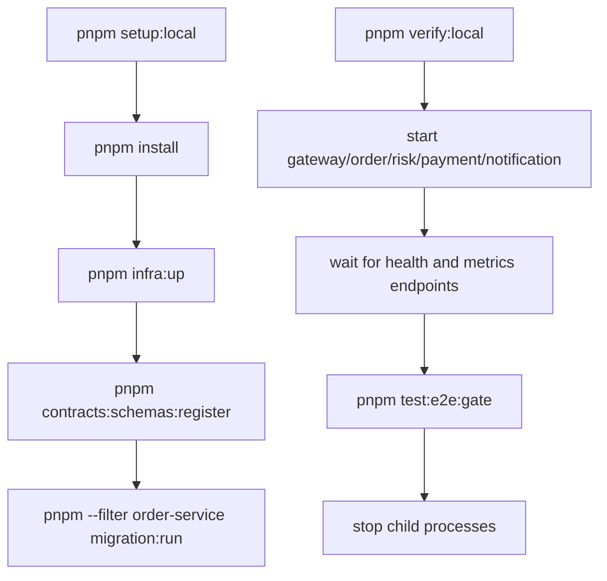
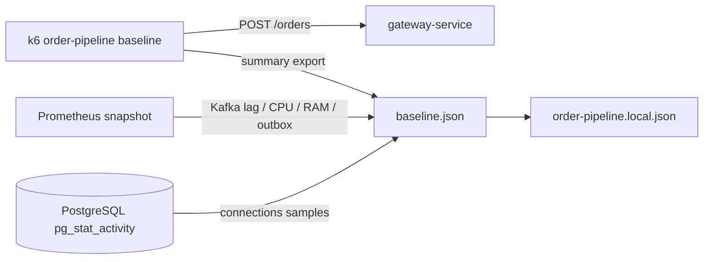

# Project Visualization

Mermaid-диаграммы текущей архитектуры проекта. Файл можно смотреть в GitHub,
WebStorm Markdown preview или любом Mermaid renderer-е.

## System Context



## Order Pipeline



## Order State Machine



## Transactional Outbox



## Durable Inbox



## Retry And DLQ



## Admin Surface

```mermaid
flowchart TD
  Request[HTTP /admin/* request]
  AuditStart[AdminAuditMiddleware attaches finish listener]
  Auth[AdminApiKeyGuard]
  Rate[AdminRateLimitGuard]
  RBAC[AdminRoles metadata check]
  Controller[Admin Controller]
  Audit[(admin_audit_events)]

  Request --> AuditStart
  AuditStart --> Auth
  Auth --> Rate
  Rate --> RBAC
  RBAC --> Controller
  Controller --> Response[HTTP response]
  Response --> Audit

  Auth -->|401| Response
  RBAC -->|403| Response
  Rate -->|429| Response

  subgraph Controllers["Current Admin Controllers"]
    DLQ[/admin/dlq]
    Outbox[/admin/outbox]
    AuditEvents[/admin/audit-events]
  end

  Controller --> DLQ
  Controller --> Outbox
  Controller --> AuditEvents
```

## Package Dependencies



## Local Development Flow



## Load Baseline


